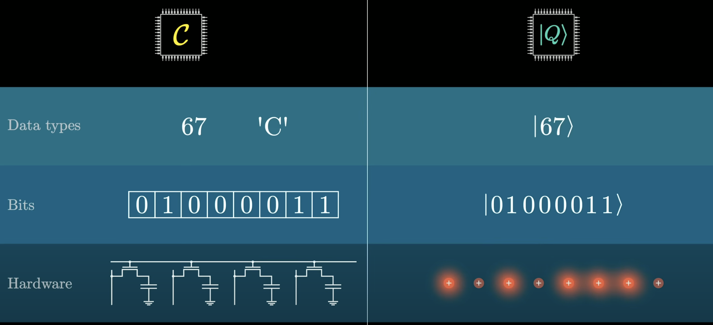

# quantum-intro

量子力学には立ち入らずに、量子計算に留める。   
理由としては以下の図で、Hardwareに当たる部分が量子力学の本論であるから。


参考サイト  
- Quantum Native Dojo  
- AIcia Solid Projectの量子計算シリーズ  
- [量子コンピュータの仕組み【グローバーのアルゴリズム】 by 
3Blue1BrownJapan   
](https://www.youtube.com/watch?v=MAz_oROjyEM) 
- [Qni TUTORIAL](https://qniapp.github.io/qni/)  


setup  
```bash 
pip install qiskit
```